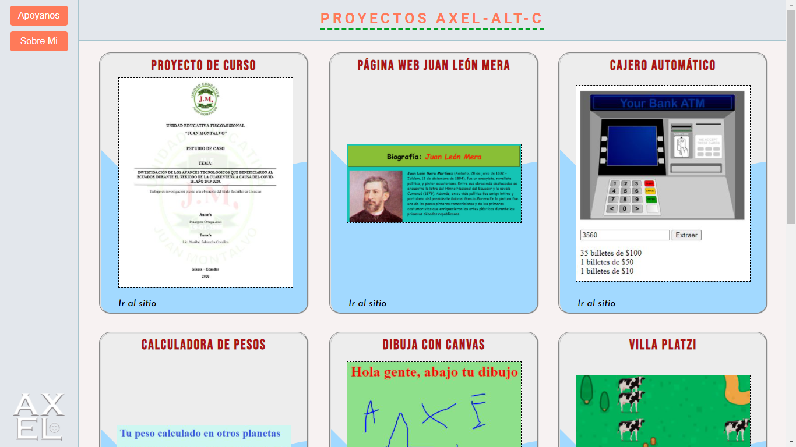
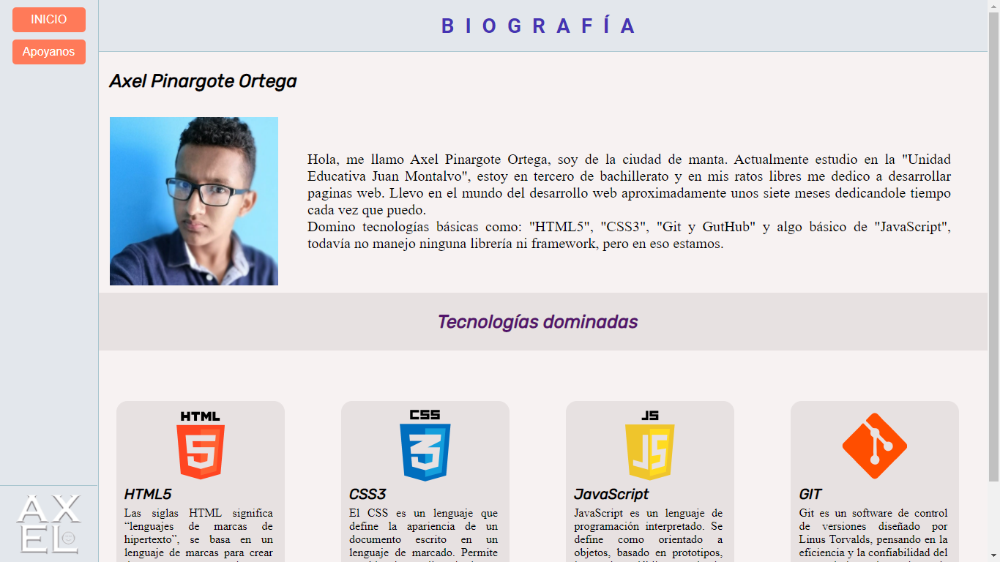
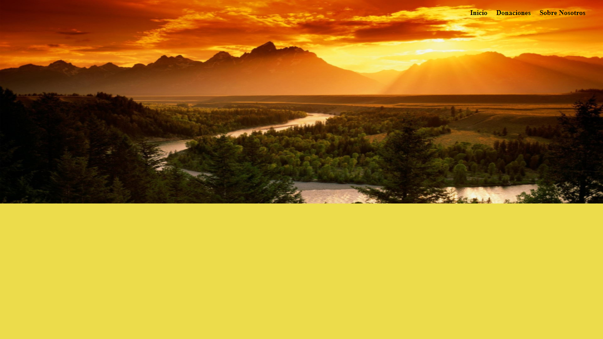
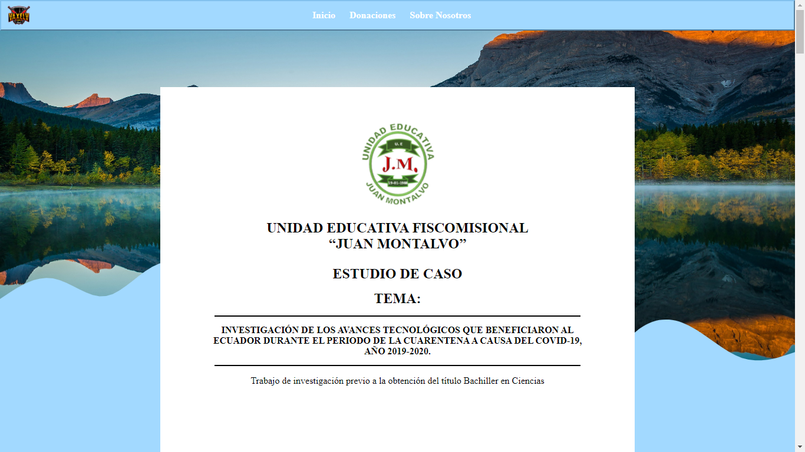

# PROYECTO CREADO CON EL ÚNICO FIN DE PRACTICAR
###### A continuación muestro un poco de lo que hay en el proyecto (son cosas que he aprendido viendo tutoriales de YouTube y algunos vídeos de Platzi. No soy un profesional ni mucho menos). Lo voy actualizando cada día y no se si algún dia lo terminaré. 
## Directorio de Proyectos
###### Añado una nueva tarjeta cada vez que sea necesario

<!DOCTYPE html>
<html lang="es">
<head>

</head>
<body>
    
</body>
</html>

# Sobre mí
###### Un poco de mi información

<!DOCTYPE html>
<html lang="es">
<head>

</head>
<body>
    
</body>
</html>

# Página de Donaciones 
###### Sin terminar 

<!DOCTYPE html>
<html lang="es">
<head>

</head>
<body>
    
</body>
</html>

# Proyecto de Curso
###### Este es el proyecto de finalización de mi colegio con el que supuestamente me voy a graduar (lo pasé a web y aún no lo termino)

<!DOCTYPE html>
<html lang="es">
<head>

</head>
<body>
    
</body>
</html>

------------

------------

> Tengo más proyectos, pero no tienen gran cosa y no los considero nada importante.

